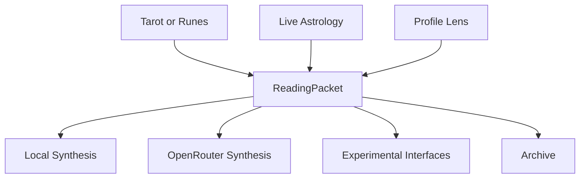

# Architecture

The architecture is packet-first.

Tarot and runes create `ReadingPacket` objects. Astrology enriches those packets. Local synthesis renders them. OpenRouter may synthesize them. Experimental interfaces remix them. Archive stores them.

## Data Flow

## Boundaries

- Tarot and runes remain standard practice tabs.
- Experimental interfaces visualize completed readings.
- LLM output never creates cards, runes, placements, transits, or chart data.
- All source data should be traceable through `sourceTrace`.

## Design Rule

The UI can be cyber-pagan. The data contracts stay sober.
